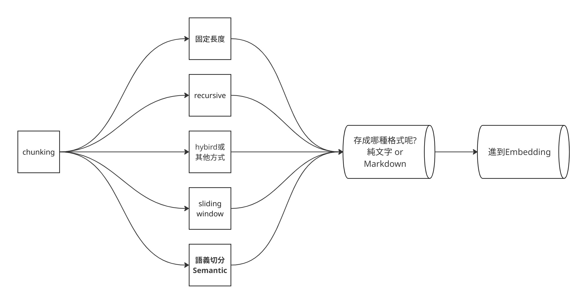

# Stage 6 — Memory · RAG · Advanced

> [繁體中文](./06-memory-rag.md) | **English**


⏱ **Time estimate**: 2 weeks (~10 hours)

> 💡 This stage is term-heavy (**RAG / vector DB / embedding / chunking / hybrid search / reranking / …**) → if any are unfamiliar, check [`resources/glossary.en.md` §3](../resources/glossary.en.md#3-memory--retrieval--rag) first.

Agents that don't remember past interactions are not useful. RAG (Retrieval-Augmented Generation) is the standard approach. This stage covers both.

## 📌 Learning Goals

- Distinguish short-term, long-term, episodic, semantic memory
- Understand vector embeddings and similarity search
- Build a basic RAG pipeline (chunk → embed → store → retrieve → generate)
- Recognize when RAG is the wrong answer (and when it's the right one)

## 📚 Required Reading

1. [**LlamaIndex — RAG concepts**](https://docs.llamaindex.ai/en/stable/getting_started/concepts/) — clearest intro
2. [**LangChain — RAG tutorial**](https://python.langchain.com/docs/tutorials/rag/) — hands-on
3. [**Pinecone — Learning Center**](https://www.pinecone.io/learn/) — vector DB fundamentals
4. [**Anthropic — Contextual Retrieval**](https://www.anthropic.com/news/contextual-retrieval) — Anthropic's RAG technique with prompt caching
5. [**LangChain — Text splitters**](https://docs.langchain.com/oss/python/integrations/splitters/index) — intro to chunking strategies

## 🧩 How to Think About Chunking

Good chunking lets an LLM generate from the most precise and complete information that fits inside a limited context window. It is not just splitting text into equal pieces. It depends on the application and document type, and it defines the smallest semantic unit your retriever can see.

A good chunk does two things at once: it is **complete enough** for the model to understand context, and **focused enough** for retrieval to avoid noise. Chunks that are too small lose context. Chunks that are too large make similarity search less precise.

Common strategies:

- **Fixed-Length**: split by character or token count. Simple and stable, but rigid enough to cut through paragraphs, sentences, or tables.
- **Sliding Window**: keep overlapping spans between chunks. This reduces boundary loss, but increases index size.
- **Recursive**: try to keep paragraphs first. If the length still does not fit, fall back to sentences, words, or smaller units. A good baseline for beginner RAG apps.
- **Semantic Chunking**: split by embedding distance or semantic shifts. In practice, this means splitting when the current chunk and previous chunk become semantically different. Useful for long documents, but more costly and complex.
- **Hybrid**: choose and combine strategies based on the application and document structure. For example, a paper may need to preserve sections, tables, formulas, and citation context.



For your first RAG app, do not start with a clever splitter. LangChain docs recommend starting with `RecursiveCharacterTextSplitter` for most use cases, then using retrieval results to decide whether to change strategy.

```python
from langchain_text_splitters import RecursiveCharacterTextSplitter

text = "This is a long document... (imagine many more words here) ..."

splitter = RecursiveCharacterTextSplitter(
    chunk_size=100,
    chunk_overlap=20,
    length_function=len,
)

chunks = splitter.split_text(text)
print(f"Split into {len(chunks)} chunks")
print(chunks[0])
```

Two quick signals tell you whether chunking is off:

- The answer misses information, or starts in the middle of an idea: chunks may be too small, or overlap may be too low.
- The answer contains the right information plus unrelated details: chunks may be too large, or top-k may be too high.

Advanced chunking questions:

- Chunking is not a one-time setting. Tune it against real queries and failure cases.
- Chunk size, overlap, top-k, and reranking affect each other. Do not inspect only one parameter.
- Think about mixed data types: if your RAG source includes image-heavy PDFs and meeting transcripts, how should the chunking strategy change?

## 🛠 Hands-on Exercises (do them, not just read)

### Exercise 1: Embeddings
Embed 100 sentences, find nearest neighbors of one query. Build intuition for what "vector distance" means.

### Exercise 2: Vector DB
Store embeddings in Chroma, query semantically. Compare against keyword search.

### Exercise 3: Chunking comparison
Take one document and split it three ways: fixed-size chunks, paragraph chunks, and heading-aware chunks. Use 5 real questions to compare top-k results, and note which strategy retrieves the right context more reliably.

### Exercise 4: Full RAG pipeline
Chunk a PDF → embed → retrieve top-k → generate answer. The basic skeleton most RAG apps use.

### Exercise 5: Long-term memory
Give an agent conversational memory across multiple sessions. Use `mem0` or roll your own with a vector store.

## 🎯 Curated Projects

### [LlamaIndex](https://github.com/run-llama/llama_index)

| Field | Value |
|---|---|
| Stars | ★ 49k+ |
| Recommendation | ⭐⭐⭐⭐⭐ |

**What it teaches**: The RAG-focused framework. Document loaders, chunking strategies, retrieval patterns, query engines.

**Best for**: Document-heavy applications. RAG is its core.

---

### [Chroma](https://github.com/chroma-core/chroma)

| Field | Value |
|---|---|
| Stars | ★ 27k+ |
| License | Apache-2.0 |
| Recommendation | ⭐⭐⭐⭐⭐ |

**What it teaches**: Open-source embedding database. Run locally, no infrastructure setup.

**Best for**: Exercise 2 and Exercise 4 above. Easiest vector DB to start with.

**Run it**:
```python
import chromadb
client = chromadb.Client()
collection = client.create_collection("hello")
collection.add(documents=["doc 1", "doc 2"], ids=["1", "2"])
results = collection.query(query_texts=["query"], n_results=1)
```

---

### [Qdrant](https://github.com/qdrant/qdrant)

| Field | Value |
|---|---|
| Stars | ★ 31k+ |
| Recommendation | ⭐⭐⭐⭐ |

**What it teaches**: Production-grade vector DB written in Rust. Faster than Chroma at scale.

**Best for**: When Chroma can't keep up. Has cloud + self-hosted modes.

---

### [Weaviate](https://github.com/weaviate/weaviate)

| Field | Value |
|---|---|
| Stars | ★ 16k+ |
| Recommendation | ⭐⭐⭐⭐ |

**What it teaches**: Vector DB with built-in modules (text2vec, generative, classification). Schema-driven.

**Best for**: Production deployments needing schema constraints.

---

### [pgvector](https://github.com/pgvector/pgvector)

| Field | Value |
|---|---|
| Stars | ★ 21k+ |
| Recommendation | ⭐⭐⭐⭐ |

**What it teaches**: Vector similarity search inside PostgreSQL. SQL + vector in one DB.

**Best for**: Teams already on PostgreSQL who don't want a separate vector store.

---

### [LangChain — Memory](https://python.langchain.com/docs/concepts/memory/)

**What it teaches**: Agent memory patterns (buffer, summary, vectorstore-backed).

**Best for**: When your agent needs to remember across sessions.

---

### [mem0ai/mem0](https://github.com/mem0ai/mem0)

| Field | Value |
|---|---|
| Stars | ★ 54k+ |
| Recommendation | ⭐⭐⭐⭐ |

**What it teaches**: Self-improving memory layer for AI agents. Stores facts about users across sessions.

**Best for**: Personal assistant / chatbot apps that need user-level memory.

---

### [Letta (formerly MemGPT)](https://github.com/letta-ai/letta)

| Field | Value |
|---|---|
| Stars | ★ 22k+ |
| Recommendation | ⭐⭐⭐⭐ |

**What it teaches**: Long-context agent with hierarchical memory. Inspired by OS memory management.

**Best for**: Agents that need very long-running context (months, not minutes).

---

### [chatchat-space/Langchain-Chatchat](https://github.com/chatchat-space/Langchain-Chatchat)

| Field | Value |
|---|---|
| Language | 中文 + Python |
| Stars | ★ 38k+ |
| License | Apache-2.0 |
| Recommendation | ⭐⭐⭐⭐ |

**What it teaches**: 中文社群最廣泛使用的 RAG + Agent 應用框架。Offline-deployable knowledge base Q&A with Chinese-friendly defaults. Supports ChatGLM / Qwen / Llama / Ollama backends.

**Best for**: Chinese-speaking learners building knowledge base / RAG apps. The defaults handle Chinese tokenization + embeddings well.

**Notes**: Last update Nov 2025 (~6 months — borderline on the active-maintenance criterion).

---

### [Anthropic — Contextual Retrieval cookbook](https://platform.claude.com/cookbook/capabilities-contextual-embeddings-guide)

**What it teaches**: Anthropic's contextual retrieval technique with prompt caching, end-to-end example.

**Best for**: After basic RAG, upgrade to contextual retrieval for better recall on long documents.

**Notes**: Anthropic renamed `anthropic-cookbook` → `claude-cookbooks` in 2025. The hosted notebook above is the canonical reference; raw GitHub paths may shift.

---

### [infiniflow/ragflow](https://github.com/infiniflow/ragflow)

| Field | Value |
|---|---|
| Language | Python |
| Stars | ★ 79k+ |
| License | Apache-2.0 |
| Recommendation | ⭐⭐⭐⭐⭐ |

**What it teaches**: Production-grade RAG engine — deep document understanding (layout, tables, OCR) + hybrid retrieval + agent loop. The "**from zero to deployed RAG service**" reference.

**Best for**: Shipping RAG to non-developers. Much more complete than LangChain RAG, but also more complex.

**Notes**: It's an open-source RAG engine (self-hostable via Docker or source). The cloud demo is for evaluation only — the project itself ships as deployable software.

---

### [HKUDS/LightRAG](https://github.com/HKUDS/LightRAG)

| Field | Value |
|---|---|
| Language | Python |
| Stars | ★ 34k+ |
| License | MIT |
| Recommendation | ⭐⭐⭐⭐ |

**What it teaches**: Graph + vector hybrid retrieval with summarization-based long-context memory. EMNLP 2025 paper-backed.

**Best for**: Anyone studying "**how do you remember long documents / long context**" with research-grade methods. Complementary to mem0 / Letta (which lean conversational memory).

**Notes**: Research-flavoured codebase, less polished than ragflow. Good for learning the concepts.

---

### [patchy631/ai-engineering-hub](https://github.com/patchy631/ai-engineering-hub)

| Field | Value |
|---|---|
| Language | Python / Jupyter |
| Stars | ★ 34k+ |
| License | MIT |
| Recommendation | ⭐⭐⭐⭐ |

**What it teaches**: Topic-by-topic LLM / RAG / agent tutorial collection — one notebook per topic, from basic RAG to agent applications.

**Best for**: Learners who want "the same concept, implemented in different ways" for comparison. Cross-stage material; placed in Stage 6 because RAG topics dominate.

---

## ✅ Self-Check Before Stage 7

Can you:
- [ ] Build a 50-line RAG pipeline (load → chunk → embed → store → query → answer)
- [ ] Explain why naive chunking fails on long documents
- [ ] Design different chunking strategies for API docs, PDFs, and tables
- [ ] Pick between Chroma, Qdrant, pgvector for a given scale
- [ ] Distinguish "give the agent memory" from "use RAG"

If yes → proceed to [Stage 7 — Multi-Agent · Production](07-multi-agent-production.md).
